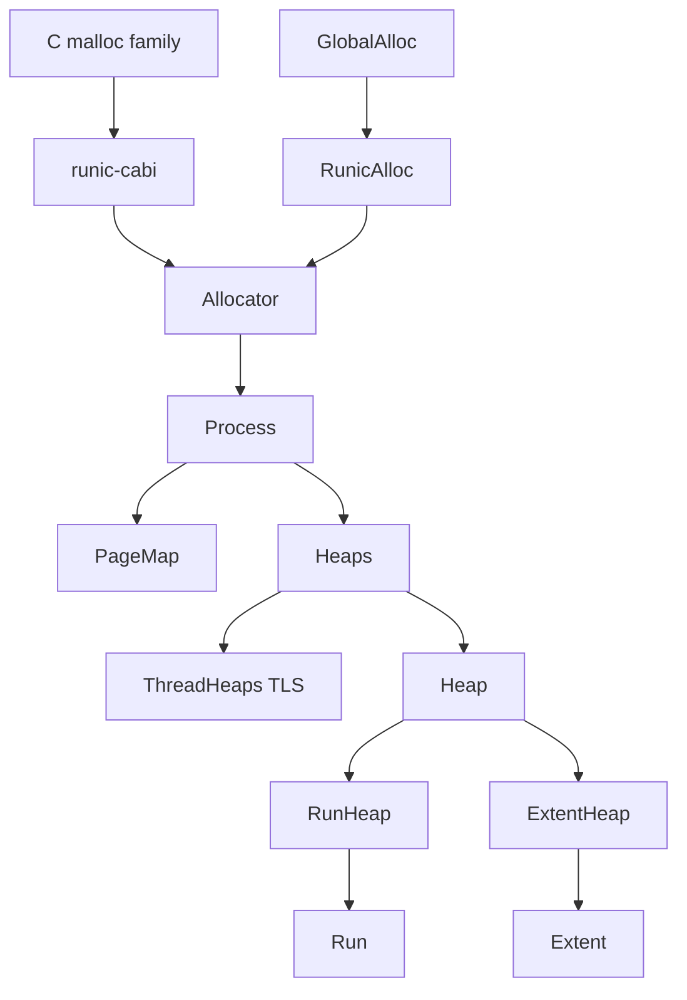

# Architecture

Runic has one process-wide payload and up to two active heaps per thread.
`RunicAlloc` and `runic-cabi` translate their public contracts, then call
`runic_core::Allocator`.

## Layers



`Process` is an mmap-backed `{ PageMap, Heaps }` that lives until process exit.
`Allocator::ctx()` is the only handle to it. Shared `&Heap` methods use
atomics; `ThreadHeaps` owns Active mutation, and `Heaps` owns Draining work.

## Small allocation

Size-classed blocks live in 64 KiB runs inside heap-owned 2 MiB maps. Each map
holds 16 run spaces. The `Run` header follows its payload; `PageMap` publishes
the payload pages only.

| Path | Work |
|------|------|
| Alloc hit | `class_for` then `current[class]` then `Run::allocate` |
| Alloc miss | `extend` if the current run is empty; inbox `accept` if nonempty; then local or OS `acquire_run` |
| Unbound alloc | `bind`, flush, then alloc |
| Owner free hit | `Run::free`: `locate` then push |
| Owner double-free | Undefined |
| Interior pointer | `locate` aborts |

`current[class]` is a hint, not ownership. A run may also be on the available
list. Free does not rewrite `current`. `push_available` and Discard stay off
the owner-free hit. Heap live counters change only at zero/nonzero boundaries.
Runs have no independent cache budget: a heap's 2 MiB maps remain owned until
the heap is reclaimed, and empty-run Discard only drops resident payload pages.
A meaningful run byte budget requires whole-map reclaim, planned for 0.12.

`Run::header_of` is the small miss and realloc probe: mask to the run base,
check the raw `base` word, then construct `Run`. Pointer-only C `free` / `resize`
use `PageMap` only. An extent mapping need not cover the run-header page, so
`header_of` can fault there. After PageMap names a run, C `free` still tries
the current-run hit.

## Extents

Layouts that do not fit a size class get a dedicated mapping. The `Extent`
slot is immortal; unmap drops `Mapping` only. Frees must be the exact returned
pointer. Owner double-free is undefined.

The default `Keep` policy retains mappings within slot and byte budgets and
reuses an exact length. `Discard` retains the mapping after `madvise`;
`Unmap` releases it. Zeroed Keep reuse at or above 64 KiB discards pages;
smaller mappings use memset.

## Remote free

A block is held by the user, the owner freelist, or a remote claim.

1. The remote thread calls `claim` (run: issued plus claim bit; extent:
   `Claimed` byte). A second claim returns `HeapError::DoubleFree`.
2. Active owner: `Heap::enqueue` (lease before a new `try_queue`).
3. Draining owner: `Heaps::{free,flush}`. The first remote thread may `adopt`
   the heap and complete an owner free. With both TLS slots full, it stays on
   `Heaps::free`.
4. Owner `flush` calls `accept`. Runs drain claim bits onto the freelist.
   Extents go `Claimed` to `Free` then `cache_or_unmap`.

`Inbox` coalesces by owner. Claimed frees retry Active/Draining transitions.
If the generation advances, the old owner already accepted the claim.

## Heap lifecycle

```text
Free -> Active  bind
Active -> Draining  unbind (wait in-flight leases, flush, then close)
Draining -> Active  adopt (lock HeapInner before the CAS)
Draining -> Free  reclaim (live atomics, then arena scans; CAS the generation)
```

`Heaps::get` reads `Arena` without a lock, then checks slot and generation with
`Heap::matches`. Occupied slots never move. The arena grow lock covers mapping
and insertion only, never flush, accept, or user copies.

`THREAD_HEAPS` has two Active slots. Each captures `&Heap` and its generation
at bind or adopt so unbind cannot close a later incarnation. Default Rust uses
a `std::thread_local!` guard for thread exit. Feature `c-abi` uses a pthread
key to avoid allocator re-entry during glibc TLS teardown under `LD_PRELOAD`.

## Pointer recovery

Every live user pointer maps to exactly one `PageOwner` (`&'static Run` or
`&'static Extent`). `PageMap::get` is lock-free on the hot tables. Publish
rejects overlap. Removal checks the expected owner before clear.

After lifecycle retries, invalid state reaches `Allocator::abort`.
`HeapError` preserves `InvalidRunPointer`, `InvalidExtentPointer`, and
`MissingExtent`.

## Memory

`Memory` is the leaf virtual-memory surface (`page_size`, `map`,
`map_aligned`, `discard`, and payload defaults). Callers
use the `Os` alias, so no layer names an operating system; `Linux` is the only
impl and holds every libc mmap, madvise, and mbind. `Mapping` uniquely owns a
live region and applies payload hints on itself (`prefer_huge` /
`prefer_local`). Extent-cache lookup uses the page-rounded mapping length.

Process, arena growth, and page-map tables use plain anonymous maps. Run and
extent payload maps call `Mapping::prefer` with `Hints`: hugepage Off / Thp
(`MADV_HUGEPAGE`) and NUMA Off / Local (`mbind` `MPOL_PREFERRED` to the
allocating thread's node). Advise or preference failure keeps a successful
map. `Hints` is copied onto `RunHeap` / `ExtentHeap` at heap construction.

## Entities

| Entity | Owns |
|--------|------|
| `RunicAlloc` | Rust `GlobalAlloc` boundary |
| `runic-cabi` | C malloc family / `LD_PRELOAD` |
| `Allocator` | Core API, abort, unbound routing |
| `AllocatorCtx` | Process-lifetime `PageMap` and `Heaps` |
| `Process` | mmap payload; not returned |
| `Heaps` | `Arena<Heap>`, Free list, unbind, Draining `free` / `flush` / `reclaim` |
| `Heap` | `HeapState`, `Inbox`, `Mutex<HeapInner>` |
| `ThreadHeaps` | Two TLS slots, `current[class]`, Active mutation |
| `Run` | In-page header, `&Heap`, freelist, claim bitmap |
| `Extent` | Dedicated mapping metadata, `&Heap`, Claimed byte |
| `PageMap` | Page-indexed lookup |
| `Os` / `Mapping` | Platform `Memory` impl; `Drop` unmaps |

Directory READMEs under `crates/runic-core/src/` document local invariants.
