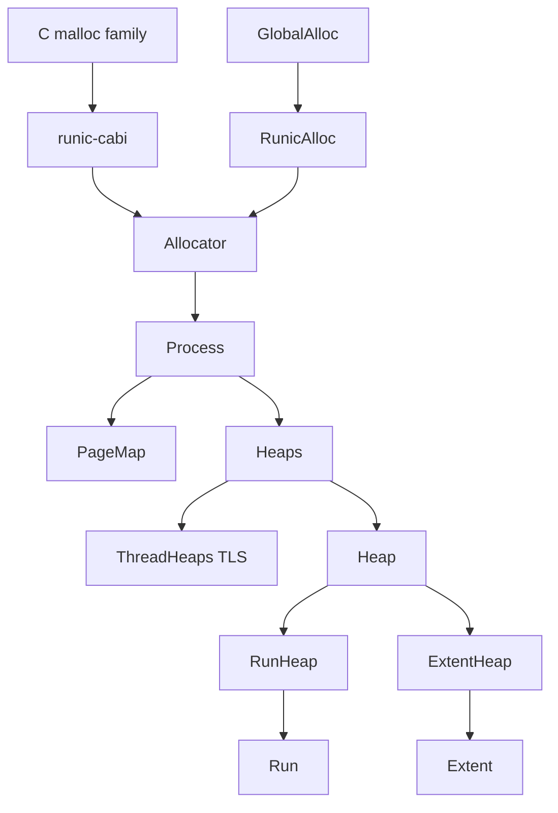

# Architecture

Runic has one process-wide payload and up to two active heaps per thread.
`RunicAlloc` and `runic-cabi` translate their public contracts, then call
`runic_core::Allocator`.

## Layers


```mermaid
flowchart TD
  C["C malloc family"] --> Cabi["runic-cabi"]
  G["GlobalAlloc"] --> RA["RunicAlloc"]
  Cabi --> A["Allocator"]
  RA --> A
  A --> P["Process"]
  P --> PM["PageMap"]
  P --> Hs["Heaps"]
  Hs --> TH["ThreadHeaps TLS"]
  Hs --> H["Heap"]
  H --> RH["RunHeap"]
  H --> EH["ExtentHeap"]
  RH --> R["Run"]
  EH --> E["Extent"]
```

`Process` is an mmap-backed `{ PageMap, Heaps }` that lives until process exit.
`Allocator::ctx()` is the only handle to it. Shared `&Heap` methods use
atomics; `ThreadHeaps` owns Active mutation, and `Heaps` owns Draining work.

## Vocabulary

One word per concept. Code, comments, and docs use these and no synonyms.

| Word | Meaning |
|------|---------|
| owner | The thread that has a heap on its `ThreadHeaps` list. Owner-local means that thread. |
| freer | A thread freeing into a heap it does not own. Remote means from a freer. |
| attached | A heap on a thread's list. `bind` links at the front, `adopt` at the back, `unbind` unlinks. |
| current | The run `ThreadHeaps` pops from for a size class. |
| hit / miss / slow | Hit is the current run. Miss is `alloc_miss`. Slow is `dealloc_slow` and `free_slow`. |
| alloc / allocate / acquire | Frontend `alloc`. A block or extent is `allocate`d. A run or heap is `acquire`d. |
| extend | Thread fresh blocks of the current run onto its freelist. |
| free | Owner returns a block or extent. |
| claim | Freer reserves a block or extent for remote admission. |
| hold | Freer links a claimed block on one of its slots. |
| slot / chain | A slot is one of sixteen `ThreadHeaps` cells, eight sets of two. Its chain is the linked claimed blocks. A chain stays open until the set needs the slot or the thread holds 16 KiB. |
| push | `Run::push` moves a chain onto the run. |
| enqueue | Put a run or extent on the owner inbox once; the link coalesces repeats. |
| flush | Owner drains an inbox and `accept`s every node. |
| accept | Owner takes a pushed chain or a claimed extent. |
| release | After an owner free, list a run that left full and discard an empty payload. |
| list / cache | `push_available` lists a run. `cache_or_unmap` caches an extent. |
| live | Outstanding blocks or extents, allocated or claimed. `is_live` on `Run`, `Extent`, and `Heap`. |
| lease | An Active enqueue in flight. `close` waits for zero. |
| admit | Draining exclusive access to `HeapInner`. |
| reclaim | Draining, empty, no leases: mark Free and bump the generation. |

## Small allocation

Size-classed blocks live in 64 KiB runs inside heap-owned 2 MiB maps. Each map
holds 16 run spaces. The `Run` header follows its payload; `PageMap` publishes
the payload pages only.

| Path | Work |
|------|------|
| Alloc hit | `class_for` then `current[class]` then `Run::allocate` |
| Alloc miss | `extend` if the current run is empty; flush every attached heap and take a run it already holds; if none has one, `acquire` on the first heap that can map |
| Unbound alloc | `bind`, flush, then alloc |
| Owner free hit | `Run::free`: `locate` then push |
| Owner double-free | Undefined on Fast; `--features safe` filters the first word, then walks the freelist |
| Interior pointer | `locate` aborts |

`current[class]` is a hint, not ownership. A run may also be on the available
list. Free does not rewrite `current`. `push_available` and Discard stay off
the owner-free hit. Heap live counters change only at zero/nonzero boundaries.
Runs have no independent cache budget: a heap's 2 MiB maps remain owned until
the heap is reclaimed, and empty-run Discard only drops resident payload pages.
A meaningful run byte budget requires whole-map reclaim, planned for 0.12.

`Run::header_of` is the small miss and realloc probe: mask to the run base,
check the raw `base` word, then construct `Run`. Pointer-only C `free` / `resize`
use `PageMap` only. An extent mapping need not cover the run-header page, so
`header_of` can fault there. After PageMap names a run, C `free` still tries
the current-run hit.

## Extents

Layouts that do not fit a size class get a dedicated mapping. The `Extent`
slot is immortal; unmap drops `Mapping` only. Frees must be the exact returned
pointer. Fast stores the state byte; a second free is undefined. `safe`
requires `Allocated` on owner `free` and aborts otherwise.

The default `Keep` policy retains mappings within slot and byte budgets and
reuses an exact length. `Discard` retains the mapping after `madvise`;
`Unmap` releases it. Zeroed Keep reuse at or above 64 KiB discards pages;
smaller mappings use memset.

## Remote free

A block is held by the user, the owner freelist, or a remote claim.

1. The freer calls `claim`. A run checks `issued`. The `safe` build also sets
   a claim bit, so a second claim returns `HeapError::DoubleFree`. Fast leaves
   that second claim undefined. An extent does the same: Fast stores
   `Claimed`, and `safe` CASes the byte.
2. The freer `hold`s the block on a `ThreadHeaps` slot. Sixteen slots are
   eight sets of two, and the run hashes into its set. A chain stays open
   until that set needs the slot, or the thread is holding 16 KiB. Then
   `Run::push` and `Heap::enqueue` (lease before a new enqueue). Thread exit
   pushes whatever is open.
3. Draining owner: push every open chain, then `adopt` and owner `free`, or
   `Heaps::{free,flush}`.
4. Owner `flush` calls `accept`, which stores the inbox link idle and splices
   the chain. `safe` clears the bits of those blocks. `Requeue` means a `push`
   landed after the take. The guard is taken only to `push_available` or
   `cache_or_unmap`. Draining `Heaps::flush` keeps one guard around accept,
   list-or-cache, and reclaim.

`Inbox` coalesces by owner. Claimed frees retry Active/Draining transitions.
If the generation advances, the old owner already accepted the claim.

## Heap lifecycle

```text
Free -> Active  bind
Active -> Draining  unbind (wait in-flight leases, flush, then close)
Draining -> Active  adopt (CAS, then hold HeapInner through the first flush)
Draining -> Free  reclaim (live atomics, then arena scans; CAS the generation)
```

`Heaps::get` reads `Arena` without a lock, then checks slot and generation with
`Heap::matches`. Occupied slots never move. The arena grow lock covers mapping
and insertion only, never flush, accept, or user copies.

`THREAD_HEAPS` is a list of Active heaps. Bind pushes the alloc heap at the
front. Adopt pushes at the back. Each heap stores the generation captured when
it was linked, so unbind cannot close a later incarnation. The last heap stays
attached. `ExitHook` arms once per thread, the first time a heap links or a
remote chain opens, and unbinds at thread exit. Default Rust registers a
`std::thread_local!` guard. Feature `c-abi` registers a pthread key to avoid
allocator re-entry during glibc TLS teardown under `LD_PRELOAD`.

## Pointer recovery

Every live user pointer maps to exactly one `PageOwner` (`&'static Run` or
`&'static Extent`). `PageMap::get` is lock-free on the hot tables. Publish
rejects overlap. Removal checks the expected owner before clear.

After lifecycle retries, invalid state reaches `Allocator::abort`.
`HeapError` preserves `InvalidRunPointer`, `InvalidExtentPointer`, and
`MissingExtent`.

## Memory

`Memory` is the leaf virtual-memory surface (`page_size`, `map`,
`map_aligned`, `discard`, and payload defaults). Callers
use the `Os` alias, so no layer names an operating system; `Linux` is the only
impl and holds every libc mmap, madvise, and mbind. `Mapping` uniquely owns a
live region and applies payload hints on itself (`prefer_huge` /
`prefer_local`). Extent-cache lookup uses the page-rounded mapping length.

Process, arena growth, and page-map tables use plain anonymous maps. Run and
extent payload maps call `Mapping::prefer` with `Hints`: hugepage Off / Thp
(`MADV_HUGEPAGE`) and NUMA Off / Local (`mbind` `MPOL_PREFERRED` to the
allocating thread's node). Advise or preference failure keeps a successful
map. `Hints` is copied onto `RunHeap` / `ExtentHeap` at heap construction.

## Entities

| Entity | Owns |
|--------|------|
| `RunicAlloc` | Rust `GlobalAlloc` boundary |
| `runic-cabi` | C malloc family / `LD_PRELOAD` |
| `Allocator` | Core API, abort, unbound routing |
| `AllocatorCtx` | Process-lifetime `PageMap` and `Heaps` |
| `Process` | mmap payload; not returned |
| `Heaps` | `Arena<Heap>`, Free list, unbind, Draining `free` / `flush` / `reclaim` |
| `Heap` | `HeapState`, `Inbox`, `Mutex<HeapInner>` |
| `ThreadHeaps` | TLS heap list, `current[class]`, Active mutation |
| `Run` | In-page header, `&Heap`, freelist, remote chain. `safe` adds claim bits |
| `Extent` | Dedicated mapping metadata, `&Heap`, state byte |
| `PageMap` | Page-indexed lookup |
| `Os` / `Mapping` | Platform `Memory` impl; `Drop` unmaps |

Directory READMEs under `crates/runic-core/src/` document local invariants.
